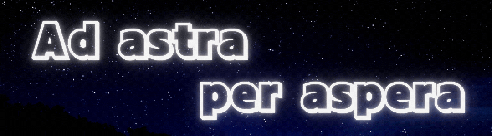

<!-- 타이틀 부분 -->

  

  

  
  

<!-- 기술 스택 -->
<h3 align="center">✨ Tech Stack ✨</h3>

  &nbsp
  &nbsp
  &nbsp
 
  &nbsp
  &nbsp
  &nbsp
  &nbsp
  &nbsp

 

<!-- 공부 중인 기술 -->
<h3 align="center">📚 Studying 📚</h3>

  &nbsp
  &nbsp
  &nbsp

 

<!-- 도구 -->
<h3 align="center">🛠 Tools 🛠</h3>

  &nbsp
  &nbsp
  &nbsp

 

<!-- 연락 -->
<h3 align="center">📫 Contact 📫</h3>

  <a href="mailto:rasca99@gmail.com">
    &nbsp
  </a>

 

<!-- 설명 추가 공간 -->

  안녕하세요!👋
세상을 향해 나아가고 있는 SJ입니다.  

저는...  
- 컴퓨터공학 전공을 '갓' 졸업한 **개발자**입니다.  
- 문제를 해결하고, 삶을 더 편리하게 만드는 기술에 관심이 많아요.  
- 제가 만든 프로그램으로 더 편리한 삶을 만드는 것이 목표입니다.  

🔧 지금 제가 개발하거나 운영 중인 것들은...  
*내용을 채워주세요!*  

🆘 개발하고 있지만, 정체 중인 프로젝트...  
*내용을 채워주세요!*  

🚀 저의 목표는...  
- 누구나 **쉽고 직관적으로 사용할 수 있는 기술**을 설계하고 개발하는 것.  
- 복잡한 기술도 **모든 사람에게 친근하고 접근 가능**하게 만들어 더 많은 이들이 혜택을 누릴 수 있도록 하는 것.  

🧑‍🤝‍🧑 제가 꿈꾸는 개발자의 역할  
- 기술의 진입 장벽을 낮추고, **모든 이들에게 공평한 기회를 제공**하는 개발자가 되는 것.  
- 단순히 기능적인 도구를 넘어서, **삶의 변화를 이끄는 혁신적인 기술**을 통해 세상에 기여하고 싶습니다.  

<!--
**Sajandora/Sajandora** is a ✨ _special_ ✨ repository because its `README.md` (this file) appears on your GitHub profile.

Here are some ideas to get you started:

- 🔭 I’m currently working on ...
- 🌱 I’m currently learning ...
- 👯 I’m looking to collaborate on ...
- 🤔 I’m looking for help with ...
- 💬 Ask me about ...
- 📫 How to reach me: ...
- 😄 Pronouns: ...
- ⚡ Fun fact: ...
-->
